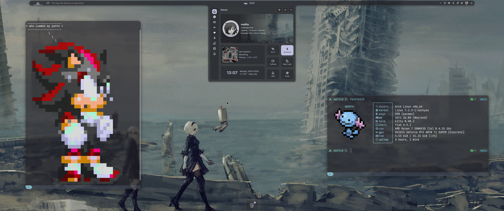

# //SNOWY

Dotfiles for my larp ass chuddy PC so I can rollback when I inevitably turn my shit into a brick.. again.

Migrated from garuda dragonized to vanilla arch because I was tired of garuda bloat & KDE exploding itself every time I ran an update

## Info

- Vanilla Arch
    - CachyOS Kernel (linux-cachyos)
- Niri WM
    - Noctalia Shell
- Kitty Terminal
    - Fish (literally only because kitty & fish sound silly)

Full system package lists exists in [~/.config/pacman](/dot_config/pacman/)

Manage backups with Chezmoi

## PC Specs // codename "SNOW"
- ROG STRIX B550-A
- Ryzen 7 5800x3D
- 2x16gb Corsair Vengeance DDR4
- Zotac 4070ti SUPER Trinity OC
- NZXT H9 Flow case (2023)
