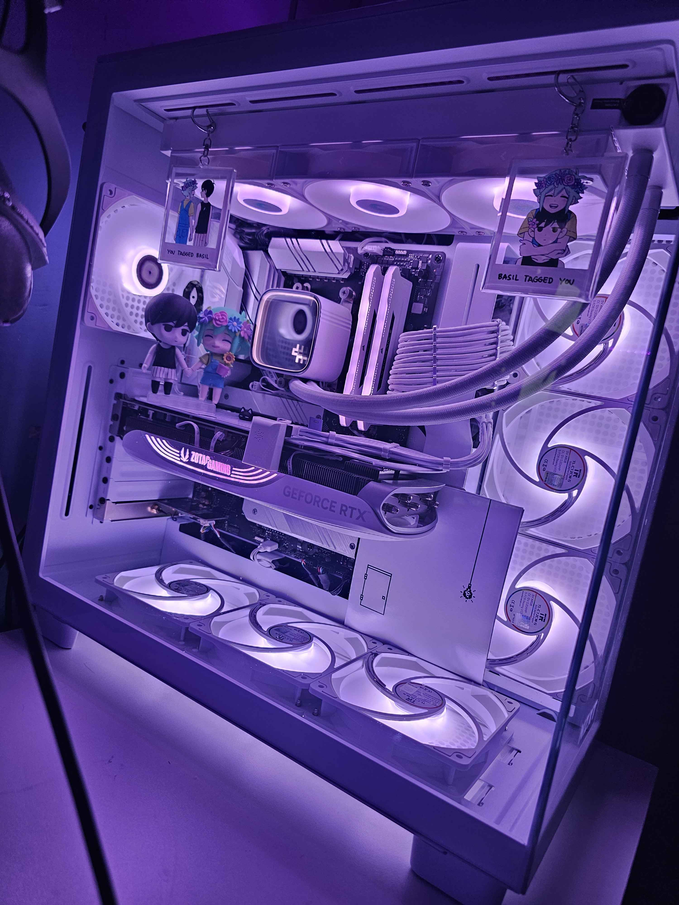

# //MATTIE'S DOTFILES

Dotfiles for my larp ass chuddy PC so I can rollback when I inevitably turn my shit into a brick.. again.

Migrated from garuda dragonized to vanilla arch because I was tired of garuda bloat & KDE exploding itself every time I ran an update

## Info

- Vanilla Arch
    - CachyOS Kernel (linux-cachyos)
- [Niri](/dot_config/niri/) WM
    - Noctalia Shell
- [Kitty](/dot_config/kitty/) terminal
    - [Fish](/dot_config/fish/) shell (literally only because kitty & fish sound silly)
  
- [Fuzzel](/dot_config/fuzzel/) app launcher

Full system package lists exists in [~/.config/pacman](/dot_config/pacman/)

Managing backups with Chezmoi

## PC Specs // codename "SNOW"
- ROG STRIX B550-A
- Ryzen 7 5800x3D
- 2x16gb Corsair Vengeance DDR4
- Zotac 4070ti SUPER Trinity OC
- NZXT H9 Flow case (2023 version)
- Main Display: Alienware AW3425DW 34in 3440x1440p 240hz QD-OLED
- Secondary Display: LG 27GR83Q Ultragear 27in 2560x1440 240hz IPS
- Audio interface: Focusrite Scarlet 2i2 4th gen
    - Audio Technica AT2020
- DAC: Fiio K11 R2R - [EQ Presets](/dot_local/share/easyeffects/output)
    - DT770 PRO 250ohm closed-back (main)
    - HiFiMan Edition XV open-back (music)
    - CrinEar Daybreak IEMs (on the go/music)

